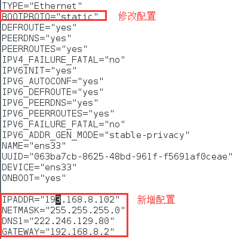

# 1. 查看虚拟网卡信息

虚拟机安装好以后，当前的系统会多出来两个虚拟网卡，一般情况下这两个网卡的命名是

> VMware Virtual Ethernet Adapter for VMnet1 
>
> VMware Virtual Ethernet Adapter for VMnet8

我们可以把虚拟机中的系统的静态IP绑定到VMnet8上，所以第一步，我们要看一下VMnet8的ip地址

## 1.1 查看虚拟网卡IP
在当前操作系统中，输入`ipconfig -all` 显示网卡的ip信息如下


记住当前VMnet8网卡的网段，如图所示，网段为:192.168.8

# 2. 虚拟机设置

2.1 打开VMware，进入`编辑 -> 虚拟网络编辑器`


2.2 选中VMnet8这个网卡，点击NAT设置


3.在NAT设置中，可以看到子网IP、网关IP等信息。这里我们需要把网关IP记录下来： 192.168.8.2


# 3. 设置虚拟机的网络连接方式

1. 选中创建好的虚拟机，右键 `设置` 进入虚拟机设置面板。
2. 将网络适配器设置为 `自定义`， 选中VMnet8这个网卡并保存


# 4. Centos7中的静态ip设置

## 4.1 找到网卡信息配置

输入命令vi `/etc/sysconfig/network-scripts/ifcfg-ens33` ,注意 ，ens33是网卡的名称，可以通过ifconfig这个命令看到具体名称。


## 4.2 修改配置

1. 设置`BOOTPROTO=“static”`
2. 添加`IPADDR/NETMASK/DNS1/GATEWAY`这几个配置



### 4.2.1 配置说明

- IPADDR：就是当前虚拟机要设置的固定ip地址，网段要一致，我这边的案例是在8网段(这个网段是VMnet8对应的子网网段，不是真实机上的网段）。
- NETMASK：子网掩码 用VMnet8对应的子网掩码值就行
- DNS1：在真实机器上通过ipconfig，获得真实机器的网卡对应的DNS地址，填在这个位置
- GATEWAY：网关地址，用前面第二个步骤中找到的网关地址： 192.168.8.2

## 4.3 重启服务

```shell
service network restart
```

# 5. 可能会遇到的问题

## 5.1. VMnet8的网段和真实机器上的网段不一样，真实机器的网段是8， 而VMnet8的网段是136. 由于网段不一致，就会存在网络不通的问题

1.1 进入VMware， 找到 编辑 ->虚拟网络编辑器


1.2 点击更改设置


修改子网IP，原本的网段是136， 改成8 网段。 保存以后，改网卡会自动重启。

## 5.2. 真实机器无法ping通虚拟机

### 原因1

虚拟机的网段设置不正确，这个网段不是真实机器的网段，而是VMnet8NAT模式对应的网段，本案例中的网段是8.

### 原因2

虚拟机迁移过，原本设置的网段在新的网络中无效，可以在VMware这个工具的如下菜单处
