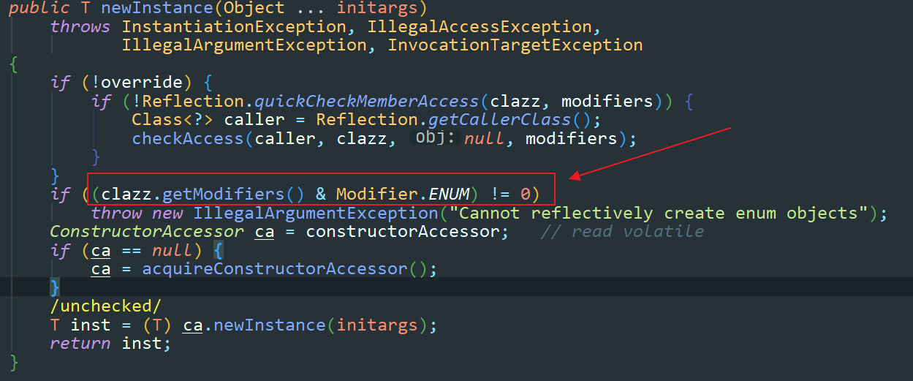
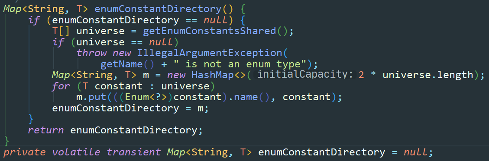

## 单例模式

确保一个类在任何情况下都绝对只有一个示例，并提供一个全局访问点。主要是为了解决类的频繁创建和销毁带来的性能损耗。


属于创建型模式。


### 1、适用场景

任何情况下都确保只有一个示例的场景。


### 2、常见写法

#### 2.1 饿汉式单例

**1、第一种方式：**

```java
public class HungrySingleton {

    public static final HungrySingleton HUNGRY_SINGLETON = new HungrySingleton();

    private HungrySingleton(){}

    public HungrySingleton getHungrySingleton(){
        return HUNGRY_SINGLETON;
    }
}
```


**2、第二种方式**

```java
public class HungryStaticSingleton {

    private static final HungryStaticSingleton HUNGRY_STATIC_SINGLETON;

    static {
        HUNGRY_STATIC_SINGLETON = new HungryStaticSingleton();
    }

    private HungryStaticSingleton(){}

    public HungryStaticSingleton getHungryStaticSingleton(){

        return HUNGRY_STATIC_SINGLETON;
    }
}
```


**优点：**

- 执行效率高

- 性能高

- 没有任何的锁

**缺点：**

- 在某些情况下，可能会造成内存浪费（不管用不用都会初始化）
- 能够被反射和序列化破坏


#### 2.2 懒汉式单例

**1、第一种方式：简单方式的懒汉式**

```java
public class LazySimpleSingleton {

    private static LazySimpleSingleton LAZY_SIMPLE_SINGLETON;

    private LazySimpleSingleton(){}

    public static LazySimpleSingleton getLazySimpleSingleton(){
        if (LAZY_SIMPLE_SINGLETON == null){
            LAZY_SIMPLE_SINGLETON = new LazySimpleSingleton();
        }
        return LAZY_SIMPLE_SINGLETON;
    }
}
```


**优点：**

- 节省了内存空间，在需要的时候才会创建对象

**缺点：**

- 线程不安全
- 能够被反射和序列化破坏


```java
public class LazySimpleSingleton {

    private static LazySimpleSingleton LAZY_SIMPLE_SINGLETON;

    private LazySimpleSingleton(){}

	//为了保证线程安全，可以使用synchronized来修饰，但是会带来性能问题。
    public synchronized static LazySimpleSingleton getLazySimpleSingleton(){
        if (LAZY_SIMPLE_SINGLETON == null){
            LAZY_SIMPLE_SINGLETON = new LazySimpleSingleton();
        }
        return LAZY_SIMPLE_SINGLETON;
    }
}
```


**2、第二种方式：双重检查锁**

```java
public class LazyDoubleCheckSingleton {

    //使用volatile来防止重排序
    private volatile static LazyDoubleCheckSingleton LAZY_DOUBLE_CHECK_SINGLETON;

    private LazyDoubleCheckSingleton(){}

    public  static LazyDoubleCheckSingleton getLazySimpleSingleton(){
        if (LAZY_DOUBLE_CHECK_SINGLETON == null){
            synchronized (LazyDoubleCheckSingleton.class){
                if (LAZY_DOUBLE_CHECK_SINGLETON == null){
                    //这个地方会发生指令重排
                    //这里有三个指令：
                    //1. 给对象分配内存空间
                    //2. 初始化对象
                    //3. 将刚刚开辟出来的内存地址赋值给对象的引用
                    //比如说，还没有进行初始化，却先进行了了赋值，紧接着被使用了，就会导致安全性的问题。
                    LAZY_DOUBLE_CHECK_SINGLETON = new LazyDoubleCheckSingleton();
                }
            }
        }
        return LAZY_DOUBLE_CHECK_SINGLETON;
    }
}
```


**优点：**

- 性能高

- 线程高

**缺点：**

- 可读性低
- 能够被反射和序列化破坏


**3、第三种方式：静态内部类**

```java
public class LazyStaticInnerClassSingleton {

    private LazyStaticInnerClassSingleton(){}

    private static class LazyHolder{
        private static final LazyStaticInnerClassSingleton INNER_CLASS_SINGLETON =
                new LazyStaticInnerClassSingleton();
    }

    public LazyStaticInnerClassSingleton staticInnerClassSingleton(){
        return LazyHolder.INNER_CLASS_SINGLETON;
    }
}
```


**优点：**

- 利用了java本身的特点，性能高，避免内存浪费

**缺点：**

- 能够被反射和序列化破坏


##### 反射破坏单利

**示例：**

```java
public class ReflectTest {
    public static void main(String[] args) {
        try {

            Class singletonClass = LazyStaticInnerClassSingleton.class;
            Constructor constructor = singletonClass.getDeclaredConstructor(
                    null);

            System.out.println(constructor);
            //因为构造方法私有化了，所以需要强吻
            constructor.setAccessible(true);

            Object o = constructor.newInstance();
            System.out.println(o);
        } catch (Exception e) {
            e.printStackTrace();
        }
    }
}
```


**解决方案：在构造方法内添加判断**

```java
private LazyStaticInnerClassSingleton(){
    if(LazyHolder.INNER_CLASS_SINGLETON != null){
        throw new RuntimeException("已经实例化了，不允许访问");
    }
}
```


##### 序列化破坏单利

**示例：**

```java
public class SeriableSingleton implements Serializable {

    private SeriableSingleton(){}

    public static final SeriableSingleton SERIABLE_SINGLETION = new SeriableSingleton();

    public static SeriableSingleton getInstance(){
        return SERIABLE_SINGLETION;
    }
}
```


测试：

```java
public class SeriableSingletonTest {

    public static void main(String[] args) {
        
        SeriableSingleton s1 = null;
        SeriableSingleton s2 = SeriableSingleton.getInstance();
        
        try {
            FileOutputStream outputStream = new FileOutputStream("SeriableSingleton.obj");
            ObjectOutputStream objectOutputStream = new ObjectOutputStream(outputStream);
            objectOutputStream.writeObject(s2);
            objectOutputStream.flush();
            objectOutputStream.close();

            FileInputStream inputStream = new FileInputStream("SeriableSingleton.obj");
            ObjectInputStream objectInputStream = new ObjectInputStream(inputStream);
            s1 = (SeriableSingleton) objectInputStream.readObject();
            objectInputStream.close();
            
            System.out.println(s1);
            System.out.println(s2);
            System.out.println(s1 == s2);

        }catch (Exception e) {
            e.printStackTrace();
        }
    }
}
```


**解决方案：**

在`SeriableSingleton`中添加一个`readResolve`方法：

```java
private Object readResolve(){
    return SERIABLE_SINGLETION;
}
```


#### 2.3 注册式单例

**1、第一种方式：枚举**

```java
public enum EnumSingleton {
    INSTANCE;

    public static EnumSingleton getInstance(){
        return INSTANCE;
    }
}
```


**为什么枚举单利能够防止反射破坏？**

在`java.lang.reflect.Constructor`类中的`newInstance()`方法中添加了一个判断。




**为什么叫注册式单例？**

当注册枚举类单例的时候，会将`INSTANCE`这个常量放到一个`Map`容器中

在`java.lang.Class`中




**优点：**

- 性能高

- 可以防止反射和序列化的破坏

**缺点：**

- 内存浪费


**第二种方式：容器式单例（对枚举式单例的优化）**

```java
public class ContainerSingleton {

    private ContainerSingleton(){}

    private static Map<String,Object> ioc = new ConcurrentHashMap<>();

    public static Object getInstance(String className){
		Object instance = null;
        if (!ioc.containsKey(className)){
            try {
                instance = Class.forName(className).newInstance();
                ioc.put(className,instance);
            } catch (Exception e) {
                e.printStackTrace();
            }
           return instance;
        }else {
            return ioc.get(className);
        }
    }
}
```


#### 2.4 ThreadLocal单例

```java
public class ThreadLocalSingleton {

    private ThreadLocalSingleton(){}

    private static  final ThreadLocal<ThreadLocalSingleton> THREAD_LOCAL_INSTANCE =
            new ThreadLocal<ThreadLocalSingleton>(){
                @Override
                protected ThreadLocalSingleton initialValue() {
                    return new ThreadLocalSingleton();
                }
            };

    public static ThreadLocalSingleton getInstance(){
        return THREAD_LOCAL_INSTANCE.get();
    }
}
```


可以实现每个线程中都只有一个对象


### 3、总结

单例模式 内存中只有一个实例，可以减少内存开销，从而避免对资源的多重占用。可以降低创建和销毁对象的开销，来提高系统性能。但是因为单例模式没有接口，所以扩展比较难，如果要扩展单例对象，就必须要修改代码。