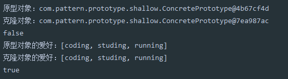
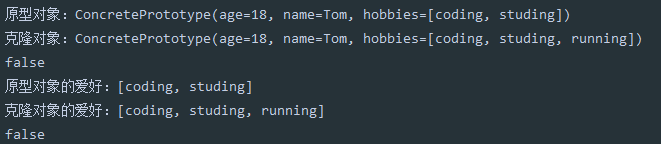

## 原型模式

原型实例指定创建对象的种类，并通过拷贝这些原型创建新的对象。调用者不需要知道任何创建细节，不调用构造函数。也就是说，原型模式主要解决的问题就是创建重复的对象，而且这个对象内容本身比较复杂，因此采用克隆的方式来节省时间。


属于创建型模式


### 1、适用场景

1. 类初始化消耗资源较多
2. new产生的一个对象需要非常繁琐的过程（数据准备、访问权限等）
3. 构造函数比较复杂
4. 循环体中生产大量对象时


### 2、示例

**1、定义一个接口**

```java
public interface IPrototype<T> {
    T clone();
}
```


**2、定义一个类，去实现这个接口，并重写clone方法**

```java
public class ConcretePrototype implements IPrototype<ConcretePrototype> {

    private int age;
    private String name;


    public int getAge() {
        return age;
    }

    public void setAge(int age) {
        this.age = age;
    }

    public String getName() {
        return name;
    }

    public void setName(String name) {
        this.name = name;
    }

    @Override
    public ConcretePrototype clone() {
        ConcretePrototype prototype = new ConcretePrototype();
        prototype.setAge(this.age);
        prototype.setName(this.name);

        return prototype;
    }

    @Override
    public String toString() {
        return "ConcretePrototype{" +
                "age=" + age +
                ", name='" + name + '\'' +
                '}';
    }
}
```


**3、测试**

```java
public class Test {

    public static void main(String[] args) {
        ConcretePrototype concretePrototype = new ConcretePrototype();
        concretePrototype.setName("ZhangSan");
        concretePrototype.setAge(18);

        ConcretePrototype clone = concretePrototype.clone();
        System.out.println(clone);
    }
}
```


### 3、浅克隆

**1、实现Cloneable接口，重写clone方法**

```
@Data
public class ConcretePrototype implements Cloneable {

    private int age;
    private String name;

    private List<String> hobbies;

    @Override
    public ConcretePrototype clone() {

        try {
            return (ConcretePrototype) super.clone();
        } catch (CloneNotSupportedException e) {
           return null;
        }
    }
}
```


**2、测试**

```java
public class Test {

    public static void main(String[] args) {
        ConcretePrototype concretePrototype = new ConcretePrototype();
        concretePrototype.setName("Tom");
        concretePrototype.setAge(18);
        ArrayList<String> hobbies = new ArrayList<>();
        hobbies.add("coding");
        hobbies.add("studing");
        concretePrototype.setHobbies(hobbies);

        ConcretePrototype clone = concretePrototype.clone();
        clone.getHobbies().add("running");

        System.out.println("原型对象："+concretePrototype);
        System.out.println("克隆对象："+clone);
        System.out.println(concretePrototype == clone);

        System.out.println("原型对象的爱好："+concretePrototype.getHobbies());
        System.out.println("克隆对象的爱好："+clone.getHobbies());
        System.out.println(concretePrototype.getHobbies() == clone.getHobbies());
    }
}
```


**3、结果**




我们发现当我们克隆完一个新的对象后，对新的克隆对象中的引用数据类型`hobbies`中的参数进行修改的时候，原来的对象中的`hobbies`中的参数也被修改了。 hobbies`为同一个。


### 4、深克隆

**1、使用序列化的方式实现深度克隆**

```java
@Data
public class ConcretePrototype implements Cloneable,Serializable{

    private int age;
    private String name;

    private List<String> hobbies;

    @Override
    public ConcretePrototype clone() {

        try {
            return (ConcretePrototype) super.clone();
        } catch (CloneNotSupportedException e) {
           return null;
        }
    }

	//深度克隆方法，序列化的方式
    public ConcretePrototype deepClone(){

        try {
            ByteArrayOutputStream bos = new ByteArrayOutputStream();
            ObjectOutputStream oos = new ObjectOutputStream(bos);
            oos.writeObject(this);

            ByteArrayInputStream bis = new ByteArrayInputStream(bos.toByteArray());
            ObjectInputStream ois = new ObjectInputStream(bis);
            return (ConcretePrototype) ois.readObject();
        } catch (Exception e) {
            e.printStackTrace();
            return null;
        }
    }
}
```


**2、测试结果**




### 5、总结

Java自带的原型模式是基于内存二进制流的拷贝，比直接new一个对象性能上提升了许多。同时可以简化创建过程。

但是原型模式必需添加克隆方法，当对现有的类进行改造的时候，需要修改代码，从而违反了开闭原则。
