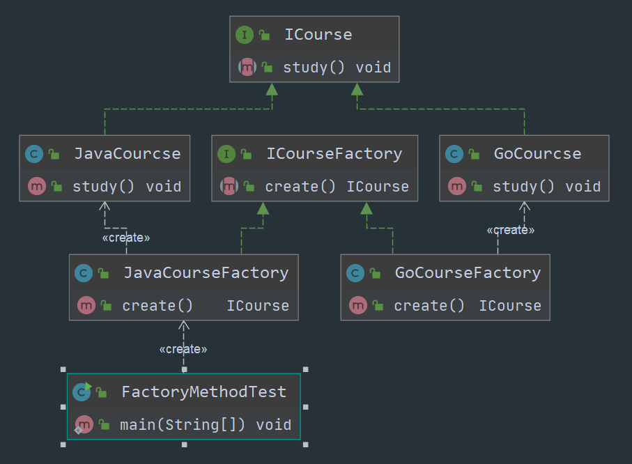
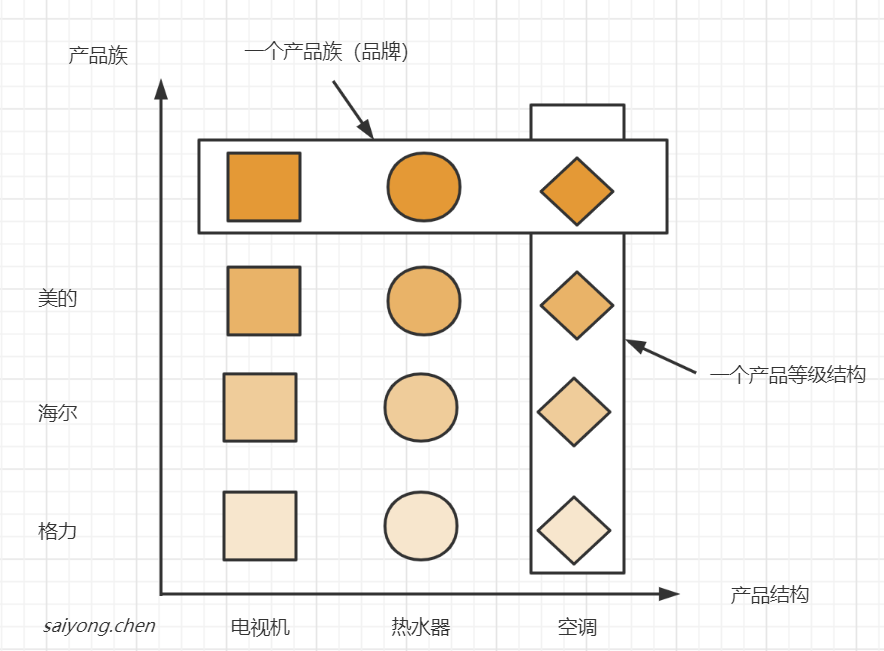
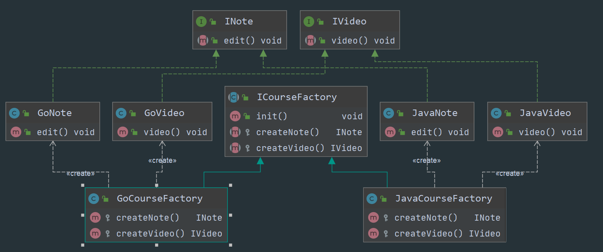

## 1. 简单工厂模式

指由一个工厂对象决定创建出哪一种产品类的示例。


属于创建型模式，但是它不属于GOF 23种设计模式。


### 1.1 适用场景

工厂类负责创建的对象较少的场景，且客户端只需要传入工厂类的参数，对如何创建对象的逻辑并不关心的场景。


### 1.2 示例：

以课程为例。


**1、定义一个课程接口**

```java
public interface ICourse {

    void study();
}
```


**2、java课程**

```java
public class JavaCourcse implements ICourse {

    @Override
    public void study() {
        System.out.println("学习 java 课程");
    }
}
```


**3、Go课程**

```java
public class GoCourse implements ICourse {

    @Override
    public void study() {
        System.out.println("学习 go 课程");
    }
}
```


**4、工厂类，负责创建java课程和go课程**

```java
public class CourseFactory {

    ICourse create(Class<? extends ICourse> clazz){
        
//        if ("java".equals(course)){
//            return new JavaCourcse();
//        }else if ("go".equals(course)){
//            return new PythonCourcse();
//        }else{
//            return null;
//        }

//        try {
//            if(!(null == course || "".equals(course))){
//                return (ICourse) Class.forName(course).newInstance();
//            }
//        } catch (Exception e) {
//            e.printStackTrace();
//        }
//        return null;

        try {
            return clazz.newInstance();
        } catch (Exception e) {
            e.printStackTrace();
        }
        return null;
    }
}
```


**5、测试类**

```java
public class SimplyFactoryTest {

    public static void main(String[] args) {

//        ICourse course = new CourseFactory().create("java");
//        course.study();

//        ICourse course = new CourseFactory().create("com.pattern.factory.simplyfactory.GoCourse");
//        course.study();

        ICourse course = new CourseFactory().create(JavaCourcse.class);
        course.study();
    }
}
```


### 1.3 总结：

简单工厂类的职责相对过重，不易于扩展过于复杂的产品结构


## 2. 工厂方法模式

定义一个创建对象的接口，让实现这个工厂接口的子类来决定实例化哪个工厂类，工厂模式使其创建过程延迟到子类中进行。

主要是为了解决产品扩展的问题，如果有很多的产品，并且创建他们的方式不同。


属于创建型模式。


### 2.1 适用场景

1. 创建对象需要大量重复的代码
2. 客户端不需要关注实例的创建等细节


### 2.2 示例：

以课程为例


**1、 定义一个课程工厂接口**

```java
public interface ICourseFactory {
	ICourse create();
}
```


**2、创建一个java课程工厂类**

```java
public class JavaCourseFactory implements ICourseFactory {
	public ICourse create() {
		return new JavaCourse();
	}
}
```


**3、创建一个go课程工厂类**

```java
public class GoCourseFactory implements ICourseFactory {
	public ICourse create() {
		return new GoCourse();
	}
}
```


**4、测试**

```java
public class FactoryMethodTest {

    public static void main(String[] args) {
        ICourseFactory courseFactory = new JavaCourseFactory();
        ICourse iCourse = courseFactory.create();
        iCourse.study();
    }
}
```


**5、类图**





### 2.3 总结：

- 满足单一职责原则，一个类负责一件事。

- 满足开闭原则，当引入新的产品的时候，只需要新增对应的类和工厂类即可。

- 可能会导致类的个数过多，从而增加系统的复杂度，变得抽象和难以理解。


## 3. 抽象工厂模式

提供一个创建一系列相关或者相互依赖对象的接口，无需指定他们具体的类。


属于创建型设计模式。


产品族与产品结构图示例：





### 3.1 适用场景

当一系列相关的产品对象，一起创建对象同时有大量重复代码的时候。

客户端不需要关注实例的创建等细节

提供一个产品类的库，所有的产品都用同样的接口实现，从而不需要依赖具体的实现


### 3.2 示例

以课程为例，我们的课程有视频和笔记


**1、定义一个视频接口和一个笔记接口（不同的产品，产品结构）**

```java
public interface INote {
    void edit();
}
```

```java
public interface IVideo {
    void video();
}
```


**2、Java程有java课程的笔记和视频，Go课程有Go课程的笔记和视频（产品族）**

```java
//java笔记
public class JavaNote implements INote {

    @Override
    public void edit() {

    }
}

//java视频
public class JavaVideo implements IVideo {

    @Override
    public void video() {

    }
}
```

```java
//go笔记
public class GoNote implements INote {

    @Override
    public void edit() {

    }
}

//go视频
public class GoVideo implements IVideo {

    @Override
    public void video() {

    }
}
```


**3、定义一个抽象工厂**

```java
public abstract class ICourseFactory {

    public void init(){
        System.out.println("初始化数据");
    }

    protected abstract INote createNote();

    protected abstract IVideo createVideo();
}
```


**4、不同的产品族分别有自己的实现工厂**

```java
//java课程工厂
public class JavaCourseFactory extends ICourseFactory {

    @Override
    protected INote createNote() {
        super.init();
        return new JavaNote();
    }

    @Override
    protected IVideo createVideo() {
        super.init();
        return new JavaVideo();
    }
}


//go课程工厂
public class GoCourseFactory extends ICourseFactory {

    @Override
    protected INote createNote() {
        super.init();
        return new GoNote();
    }

    @Override
    protected IVideo createVideo() {
        super.init();
        return new GoVideo();
    }
}
```


**5、类图**





### 3.3 总结

规定了所有可能被创建的产品的集合，在实际开发过程中，我们不一定一次性的将所有的产品族抽象出来，当产品族中需要扩展新的产品时则需要修改抽象工厂接口。从而违反了开闭原则。

从上述的示例中我们也发现，抽象工厂的类更多了，从而增加了系统的抽象性和理解难度，导致系统变得过于复杂。

