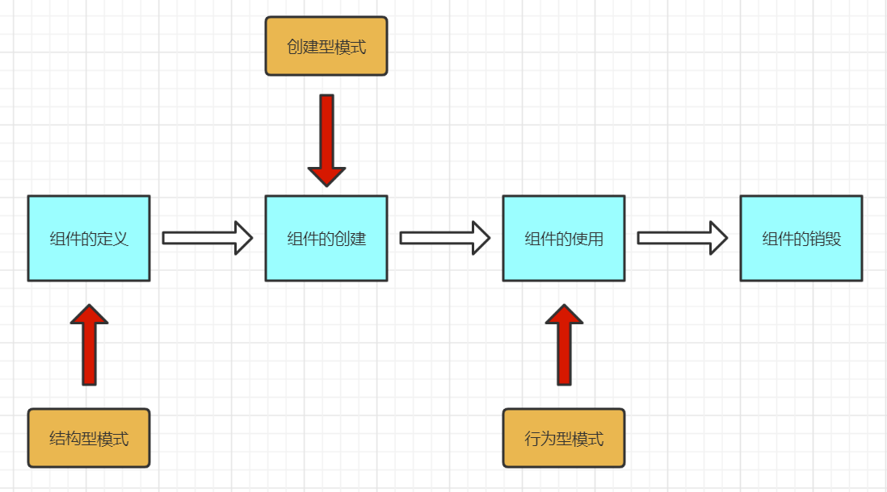
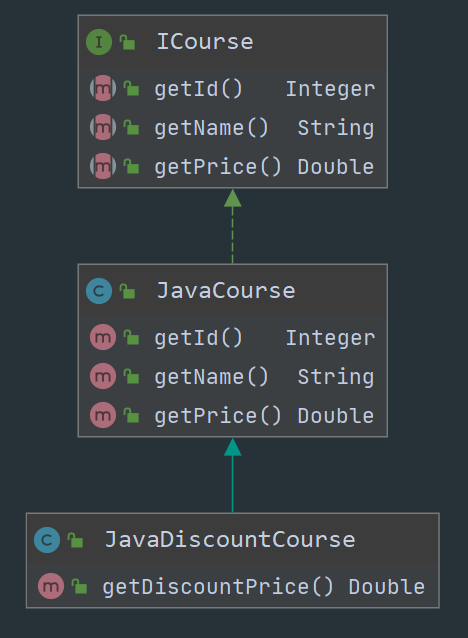
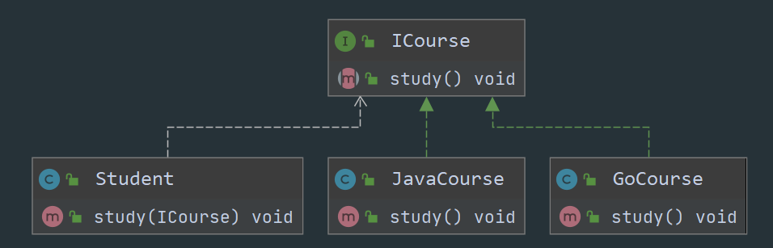
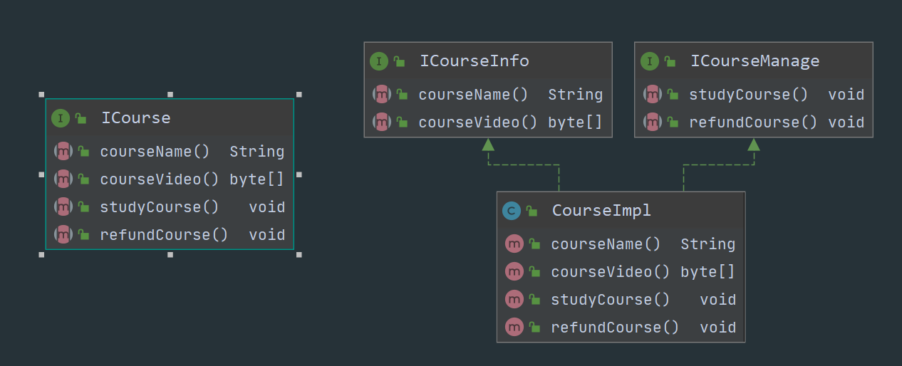
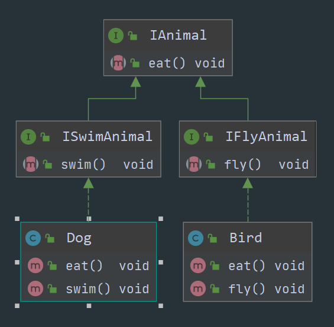
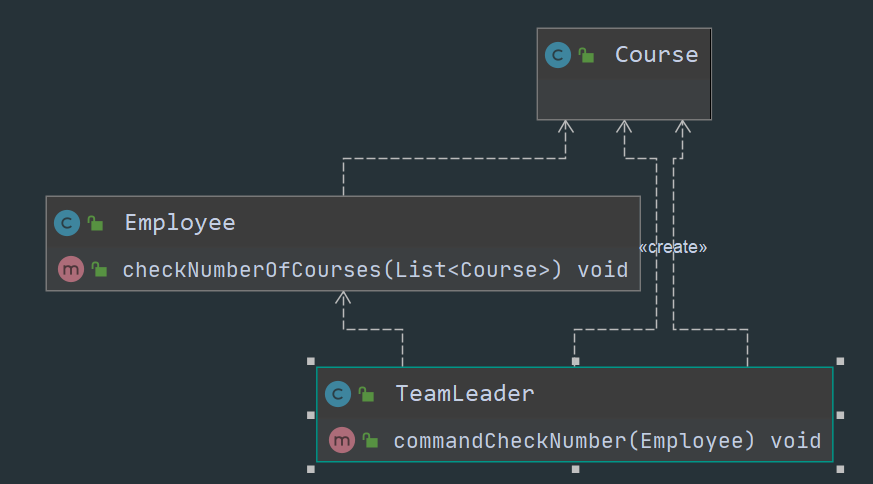
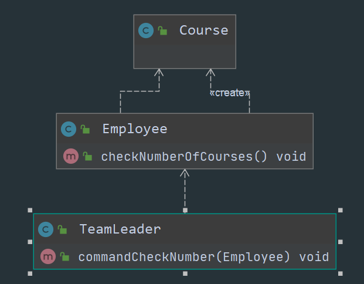
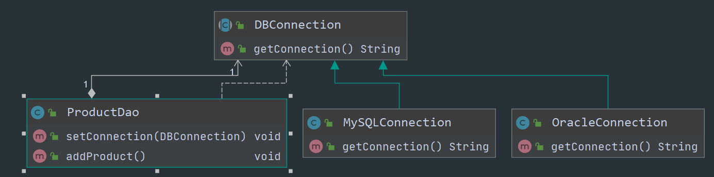

# 1、设计模式

设计模式（Design pattern）代表了最佳的实践，通常被有经验的面向对象的软件开发人员所采用。设计模式是软件开发人员在软件开发过程中面临的一般问题的解决方案。这些解决方案是众多软件开发人员经过相当长的一段时间的试验和错误总结出来的。


## 1.1 设计模式的分类

- 创建型模式：
  - 关注如何创建对象
  - 可以降低系统的耦合度
  - 使用者不需要关心对象创建的细节
- 结构型模式
- 行为型模式


# 2、一个组件的生命周期




# 3、七大设计原则

## 1. 开闭原则

一个软件实体，如类、模块和函数应该对扩展开放，对修改关闭。

用抽象构建框架，用实现扩展细节。


### 1.1 优点：

可以提高软件系统的可复用性和维护性


### 1.2 示例：

假设我们有一个课程，课程有名称和价格。但是我们有的时候需要对这个课程进行打折出售。


**1、定义一个课程接口：**

```java
public interface ICourse {
   Integer getId();
   String getName();
   Double getPrice();
}
```


**2、实现java课程：**

```java
public class JavaCourse implements ICourse{

    private Integer Id;
    private String name;
    private Double price;

    public JavaCourse(Integer id, String name,Double price){
        this.Id = id;
        this.name = name;
        this.price = price;
    }

    @Override
    public Integer getId() {
        return this.Id;
    }

    @Override
    public String getName() {
        return this.name;
    }

    @Override
    public Double getPrice() {
        return this.price;
    }
}
```


**3、如果课程售卖，需要打折：（不修改原来的java课程类，而是新增一个扩展类）**

```java
public class JavaDiscountCourse extends JavaCourse {

    public JavaDiscountCourse(Integer id, String name, Double price) {
         super(id, name, price);
    }

    public Double getDiscountPrice(){
        return super.getPrice() * 0.6;
    }
}
```


**4、	类图：**





## 2. 依赖倒置原则

高层的模块不应该依赖低层模块，两者都应该依赖其抽象，抽象不应该依赖细节，细节应该依赖抽象。
总结一句话，<font color="red">面向接口编程，而不是面向实现类编程</font>


### 2.1 优点：

- 可以减少类之间的耦合
- 提高系统稳定性、可读性和维护性
- 降低修改代码所造成的风险


### 2.2 示例：

还是已课程为例，现在我们有两个课程，某个学生同时学习这两个课程。

```java
public class Student {
	//学习java课程
    public void studyJavaCourse(){
        System.out.println("Student正在学习java课程");
    }

	//学习java课程
    public void studyGoCourse(){
        System.out.println("Student正在学习Go课程");
    }
}
```

这样的坏处就是，当我们需要学习新的课程的时候，就需要修改这个学生类。


**1、通过依赖倒置原则修改，定义一个课程接口：**

```java
public interface ICourse {
    void study();
}
```


**2、java课程：**

```java
public class JavaCourse implements ICourse {
    @Override
    public void study() {
        System.out.println("student正在学习java课程");
    }
}
```


**3、Go课程：**

```java
public class GoCourse implements ICourse {
    @Override
    public void study() {
        System.out.println("student正在学习Go课程");
    }
}
```


**4、修改学生类：**

```java
public class Student {

    public void study(ICourse iCourse){
        iCourse.study();
    }
}
```


**5、类图**





## 3. 单一职责原则

不要存在多余一个导致类变更的原因

一个类、接口或方法只负责一项职责，也就是自己的类只负责自己的事情


### 3.1 优点：

- 降低类的复杂度
- 提高类的可读性和维护性
- 降低类变更引起的风险


### 3.2 示例：

还是以课程为例，管理课程


**1、定义一个接口：(基本信息和行为放在了一起)**

```java
public interface ICourse {
    //获取课程名称和字节流
    String courseName();
    byte[] courseVideo();
    
    //学习课程和退费
    void studyCourse();
    void refundCourse();
}
```


**2、实现类：**

```java
public class CourseImpl implements ICourse {

    @Override
    public String courseName() {
        return null;
    }

    @Override
    public byte[] courseVideo() {
        return new byte[0];
    }

    @Override
    public void studyCourse() {

    }

    @Override
    public void refundCourse() {

    }
}
```

这里一个类会承担一个以上的职责


**3、现在我们使用单一职责进行修改，定义一个课程信息接口和一个课程管理接口，将职责进行拆分**

```java
//课程信息
public interface ICourseInfo {
    String courseName();
    byte[] courseVideo();
}

//课程管理
public interface ICourseManage {
    void studyCourse();
    void refundCourse();
}
```


4、添加实现类：

```java
public class CourseImpl implements ICourseInfo, ICourseManage {

    @Override
    public String courseName() {
        return null;
    }

    @Override
    public byte[] courseVideo() {
        return new byte[0];
    }

    @Override
    public void studyCourse() {

    }

    @Override
    public void refundCourse() {

    }
}
```


**5、类图**





## 4. 接口隔离原则

一个类对应一个类的依赖应该建立在最小的接口上，而不是建立一个单一的总接口（有的接口方法这个实现类并不需要）。

也就是说<font color="red">每个类都应该建立自己的专属接口，不应该依赖它不需要的接口，也不要建立一个万能的接口</font>


**注意：尽量细化接口**


### 4.1 优点：

- 实现高内聚和低耦合
- 具有很好的可读性、扩展性和维护性


### 4.2 示例：

以动物为例，有会飞的动物，也有会游泳的动物


**1、定义一个总的动物的接口：**

```java
public interface IAnimal {

    void eat();
}
```


**2、定义一个会飞的动物的接口**

```java
public interface IFlyAnimal extends IAnimal {

    void fly();
}
```


**3、在定义一个会游泳的动物的接口：**

```java
public interface ISwimAnimal extends IAnimal {

    void swim();
}
```


**4、添加鸟的实现类：**

```java
public class Bird implements IFlyAnimal {
    @Override
    public void eat() {

    }

    @Override
    public void fly() {

    }
}
```


**5、添加狗的实现类：**

```java
public class Dog implements ISwimAnimal {
    @Override
    public void eat() {

    }

    @Override
    public void swim() {

    }
}
```


**6、类图**





## 5. 迪米特法则

迪米特法则又叫最少知道原则，一个对象应该对其他对象保持最少了解，尽量降低类与类之间的耦合


假如系统中有一个类需要和该系统中的很多个类进行交互，这个类不需要与每个需要交互的类交互，而是通过一个中间者进行交互


### 5.1 优点：

降低类之间的耦合

过度使用会导致系统中存在很多中间者，从而提高系统的复杂度


### 5.2 示例：

领导要员工检查课程数量


**1、定义课程类**

```java
public class Course {
}
```


**2、员工类：**

```
public class Employee {
    public void checkNumberOfCourses(List<Course> list){
    	 System.out.println("课程的数量为:"+ list.size());  
    }
}
```


**3、领导类：**

```java
public class TeamLeader {
    public void commandCheckNumber(Employee employee){
		ArrayList<Course> courseList = new ArrayList<>();
        for (int i = 0; i < 100; i++){
            courseList.add(new Course());
        }
        employee.checkNumberOfCourses(courseList);
    }
}
```

这里领导类和课程类强耦合了，领导只需要知道课程的数量就可以了。


**4、类图：**





**5、通过最少知道原则进行修改：**

```java
//员工类
public class Employee {
    public void checkNumberOfCourses(){
        ArrayList<Course> courseList = new ArrayList<>();
        for (int i = 0; i < 100; i++){
            courseList.add(new Course());
        }
        System.out.println("课程的数量为:"+ courseList.size());
    }
}

//领导类
public class TeamLeader {
    public void commandCheckNumber(Employee employee){
        employee.checkNumberOfCourses();
    }
}
```


**6、类图：**





## 6. 里式替换原则

一个软件实体如果能够使用一个父类的话，那一定可以使用它的子类。所有引用父类的地方，使用其子类进行替换，程序的逻辑不变。也就是说子类可以扩展父类的功能，但是不能改变父类原有的功能。

总之一句话，<font color="red">继承父类而不是改变父类</font>


**注意：**

1. 子类可以实现父类的抽象方法，但是不能覆盖父类的抽象方法
2. 子类可以增加自己特有的方法
3. 子类`重载`父类的方法时，方法的前置条件（入参）要比父类方法的输入参数更加宽松
4. 子类实现（重写、重载、实现抽象方法）父类的方法时，方法的后置条件（输出，返回值）要比父类更加严格或者相等。


### 6.1 优点：

- 约束继承泛滥
- 提高程序的健壮性和兼容性
- 提高程序的维护性、扩展性
- 降低需求变更带来的风险


### 6.2 示例：

长方形和正方形


**1、 定义长方形**

```java
public class Rectangle {

    private long height;
    private long width;

    public long getHeight() {
        return height;
    }

    public void setHeight(long height) {
        this.height = height;
    }

    public long getWidth() {
        return width;
    }

    public void setWidth(long width) {
        this.width = width;
    }

    public void resize(Rectangle rectangle) {
        //修改长方体的高度，并打印。
        //当高度大于宽度的时候停止打印
        while (rectangle.getWidth() >= rectangle.getHeight()) {
            rectangle.setHeight(rectangle.getHeight() + 1);
            System.out.println("width: " + rectangle.getWidth() + " , height: " + rectangle.getHeight());
        }

        System.out.println("Resize End, width: " + rectangle.getWidth() + " , height: " + rectangle.getHeight());
    }
}
```


**2、定义正方形，继承长方形**

```java
public class Square  extends Rectangle{
	//定义边长
    private long length;

    public long getLength() {
        return length;
    }

    public void setLength(long length) {
        this.length = length;
    }

	//因为正方体的宽和高相同，所以修改继承方法
    @Override
    public long getHeight() {
       return getLength();
    }

    @Override
    public void setHeight(long height) {
        setLength(height);
    }

    @Override
    public long getWidth() {
        return getLength();
    }

    @Override
    public void setWidth(long width) {
        setLength(width);
    }
}
```


**4、测试**

```java
public class SimpleTest {

    public static void main(String[] args) {

        //长方形
        Rectangle rectangle = new Rectangle();
        rectangle.setWidth(20);
        rectangle.setHeight(10);
        resize(rectangle);

        //正方形，因为高和宽一样，所以会导致resize方法无限循环，改变了方法本来的逻辑
        Square square = new Square();
        square.setLength(10);
        resize(square);
    }
}
```


**5、修改：定义一个四边形的接口，长方形和正方形都实现这个接口**

```java
//四边形
public interface QuadRangle {
    long getWidth();
    long getHeight();

    //修改边长
    void resize();
}
```


**6、长方形**

```java
public class Rectangle implements QuadRangle {

    private long height;

    private long width;

    @Override
    public long getHeight() {
        return height;
    }

    public void setHeight(long height) {
        this.height = height;
    }

    @Override
    public long getWidth() {
        return width;
    }

    public void setWidth(long width) {
        this.width = width;
    }

    @Override
    public void resize() {
        while (this.getWidth() >= this.getHeight()) {
            this.setHeight(this.getHeight() + 1);
            System.out.println("width: " + this.getWidth() + " , height: " + this.getHeight());
        }

        System.out.println("Resize End, width: " + this.getWidth() + " , height: " + this.getHeight());
    }
}
```


**8、正方形**

```java
public class Square implements QuadRangle {

    private long length;

    public void setLength(long length) {
        this.length = length;
    }

    @Override
    public long getWidth() {
        return this.length;
    }

    @Override
    public long getHeight() {
        return this.length;
    }

    @Override
    public void resize() {
        //在现在长度的程度增加长方体的边长，最多累加10次，并打印
        long result = getHeight();
        for (long i = this.length; i <= result + 10; i++) {
            setLength(i);
            System.out.println("width: " + this.getWidth() + " , height: " + this.getHeight());
        }
        System.out.println("Resize End, width: " + this.getWidth() + " , height: " + this.getHeight());
    }
}
```


## 7. 合成复用原则

尽量使用对象的组合、聚合，而不是继承来实现软件的复用


### 7.1 优点：

- 可以使系统更加灵活
- 降低类与类之间的耦合度
- 减少一个类的变化，对其他类造成影响


### 7.2 示例：

假设我们想要去连接数据库，添加数据。


**1、抽象一个数据库连接类**

```java
public abstract class DBConnection {
	public String getConnection() {
		return null;
	｝
}
```


**2、分别有MySQL数据库和Oracle数据库**

```java
//mysql连接
public class MySQLConnection extends DBConnection {
	@Override
	public String getConnection() {
		return "获取MySQL连接";
	}
}

//Oracle连接
public class OracleConnection extends DBConnection {
	@Override
	public String getConnection() {
		return "获取Oracle连接";
    }
}
```


**3、我们要获取数据库连接的时候，只需要持有他们共同的接口后者抽象类即可**

```java
public class ProductDao {

    private DBConnection dbConnection;

    public void setConnection(DBConnection dbConnection){
        this.dbConnection = dbConnection;
    }

    public void addProduct(){
        String conn = dbConnection.getConnection();
        System.out.println(conn);
    }

}
```


**4、类图：**





## 8. 总结

在实际的开发过程中，不是一定要求所有的代码都遵循设计原则，我们需要考虑其他的因素，如：开发时间，开发人员等等。只需要在适当的场景下遵循设计原则即可。
